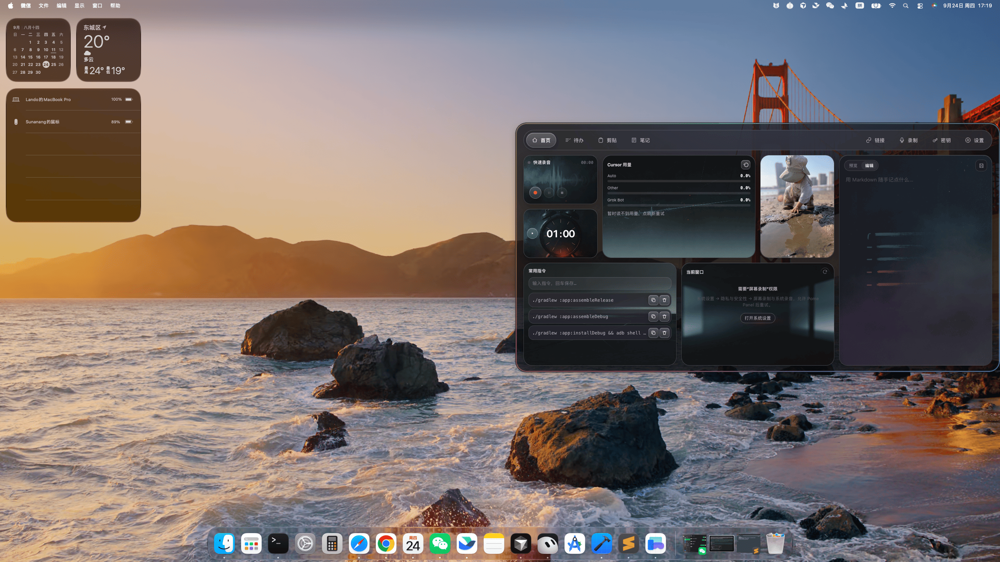
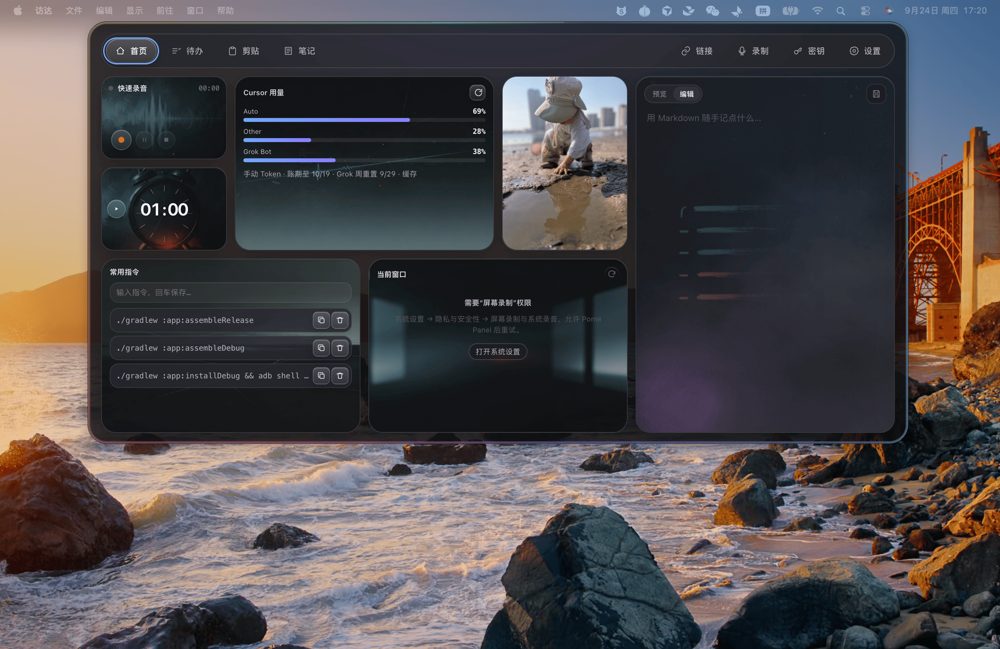

<div align="center">
  
  <h1>Pome Panel</h1>
  <p><strong>Mac 与 Windows 的贴顶工作台。</strong></p>
  <p>基于 Todo Panel 继续演进：待办、笔记、链接、录音与本机 AI 提醒，始终贴顶待命。</p>
  <p>
    <a href="#从源码运行">从源码运行</a>
    ·
    <a href="https://github.com/Sunanang/Pome-Panel/issues">反馈问题</a>
  </p>
  <p>
    
    
    
    
  </p>
</div>





## 基于 Todo Panel

**Pome Panel 是 Todo Panel 的二次开发，不是另一款从零写起的贴顶应用。**

Todo Panel 定下了这套产品的骨架：一块贴在屏幕顶部的本地工作台。它默认收成刘海或一条细条，点开后从顶部垂下，把待办、笔记、链接、录制、密钥和可选的剪贴板放在同一处，并接收本机 AI 助手的完成提醒。数据留在这台电脑上，不依赖云端账号。

Pome Panel 继承这套想法和交互，在 **Pome Panel（石榴 / Pome）** 这个名字下继续往前做。桌面端仍是单一 Electron 应用：折叠、展开、任务完成提醒，以及悬停后按空格唤出，都在主进程和渲染层里完成。

相对 Todo Panel，这个仓库里最清楚的延伸是 **飞牛 NAS 伴侣面板** 和 **多设备同步**：

- 飞牛侧是 `fnos/` 里的 **Pome Panel Sync**。在已登录的飞牛网关会话中打开它，可以生成一次性配对码，并看到已经绑定的设备。
- 桌面端在「设置 → NAS 同步」里填写地址和配对码，完成绑定。设备令牌由系统安全存储加密，不写入 LocalStorage。
- 共享协议在 `packages/sync-protocol`。已接入同步的是待办、笔记、链接、常用指令、剪贴板、录音、AI 配置和密钥。首页布局仍只留在本机。密钥与 API Key 以加密盒传输，不写进明文日志。

飞牛同步是可选附加能力。本机工作区仍是数据的落点，NAS 不是用来替换本地存储的云服务。仓库里没有为 Todo Panel 登记可核对的上游地址，因此这里只以项目名称指称它。

## 它是什么

Pome Panel 常驻 macOS / Windows 屏幕顶部。Mac 上折叠态宽 200px，高度等于当前屏幕的菜单栏高度，不超出物理刘海；Windows 上是贴在工作区顶部、避开任务栏的 200 × 38 逻辑像素悬浮条。点击后从顶部展开，各页内容区为 `1240 × 540`。

| 页面 | 解决什么问题 |
| --- | --- |
| **首页** | Bento 工作台：镜子、快速录音、随笔记、常用指令、汽水音乐、番茄钟、当前窗口，以及可选的 Cursor 用量。组件可以隐藏，也可以进入布局编辑；隐藏后其余格子重新铺满，至少保留一个 |
| **待办** | 四个可改名的工作流（内部键仍是 P0–P3）。新建默认当天 23:30，按截止时间排序，到期前一小时提醒。截止日期可逐月切换并跨年 |
| **笔记** | Markdown 速记保存后进入独立笔记页，可搜索、重命名、编辑和删除 |
| **链接** | 只保存公开的 http/https。抓取标题时会阻止本机、内网地址和不安全重定向 |
| **录制** | 音频写入本机 `recordings/`，转写与元数据留在本地。可选百炼 Qwen3-ASR 实时转写，API Key 经系统安全存储或环境变量读取 |
| **密钥** | 账号、密码和 API Key 使用系统安全存储加密，渲染页面不能直接读出明文 |
| **设置** | 面板内配置转写与智能命名 API、Cursor 用量 Token、NAS 同步、功能显隐、首页组件、镜子封面、默认展开页、唤出快捷键、数据目录和开机启动 |

剪贴板历史默认关闭，可从菜单栏或「设置 → 显示功能」里打开。它只在本机轮询采集，不再占用全局快捷键。Windows 上点击条目是复制，再用 Ctrl+V 粘贴。

Codex、Claude Code 与 GPT 的本机完成事件会显示成不抢焦点的顶部提醒。子代理结束和云端会话不会弹出。

Windows 首版不显示「当前窗口」和「汽水音乐」，也不会改写你已经保存的显隐偏好。AI 完成提醒在 Windows 上点击即关闭。

## 设计原则

- **贴顶但不打扰**：折叠态只占菜单栏或一条细条；展开和提醒都不使用系统窗口动画，视觉动效留在渲染层，并尊重「减少动态效果」。
- **设备按需启用**：镜子只有主动点击才开摄像头，离开首页或收起时立刻释放；麦克风同样只在你开始录音后使用，结束录音或退出应用时释放。
- **数据留在本机**：待办、笔记、链接、录音元数据和工作区设置写在本地，没有后端账号。可更换数据文件夹，把这份工作区拷到另一台电脑继续用；系统加密过的密钥不保证跨电脑迁移。
- **权限边界清晰**：链接抓取拒绝本机、内网和不安全重定向；窗口聚焦只接受最近一次扫描缓存里的窗口 ID；剪贴板跳过密码管理器标记为敏感的内容。
- **NAS 同步是附加项**：飞牛伴侣用来在多台设备之间同步待办、笔记、链接、常用指令、剪贴板、录音、AI 配置和密钥。它不取代本机存储，也不是一套云端工作台。明文 HTTP 默认关闭，回环地址除外。

## 本机 AI 完成提醒

Pome Panel 只在 `127.0.0.1:43821` 监听通知接口，来源限 `codex`、`claude` 与 `gpt`，其余一律 404：

```bash
curl -X POST http://127.0.0.1:43821/notify/codex \
  -H 'Content-Type: application/json' \
  -d '{"title":"任务已完成","project":"my-project","task_id":"demo"}'
```

仓库提供 [Codex 转发脚本](scripts/codex-notify.js) 和 [Claude Code 转发脚本](scripts/claude-notify.js)。Codex 走 `~/.codex/config.toml` 的 notify；Claude Code 走 `~/.claude/settings.json` 的 Stop 钩子。云端会话（`CLAUDE_CODE_REMOTE=true`）会直接放弃，因为那里的 `127.0.0.1` 不是你这台电脑。

## 从源码运行

桌面端要求 Node.js 18 及以上：

```bash
git clone https://github.com/Sunanang/Pome-Panel.git
cd Pome-Panel
npm install
npm test
npm start
```

没有渲染层构建步骤。`npm start` 就是完整的桌面运行路径。

| 命令 | 用途 |
| --- | --- |
| `npm test` | 单元测试与 JavaScript 语法检查 |
| `npm start` | 启动 Electron 开发版 |
| `npm run pack` | 生成本地未打包目录 |
| `npm run build` | 在 macOS 上构建 Apple Silicon 产物 |
| `npm run build:win` | 在 Windows 上构建 x64 产物 |
| `npm run build:zip` | 构建 ZIP 产物 |

官网在 `website/`，要求 Node.js 22.13.0 及以上，技术栈是 React 19 与 Vinext：

```bash
cd website
npm install
npm run dev
```

检查官网时使用 `npm run lint` 与 `npm run build`。

## 项目结构

```text
.
├── main.js                  # Electron 主进程：窗口、定位、菜单栏、剪贴板、媒体与通知
├── main-services.js         # 可单测的纯领域服务
├── preload.js               # contextBridge 安全桥
├── renderer/                # 桌面界面与交互
├── packages/sync-protocol/  # 桌面端与飞牛伴侣共用的同步协议
├── fnos/                    # 飞牛 NAS 伴侣应用 Pome Panel Sync
├── scripts/                 # Codex / Claude Code 通知转发
├── tests/                   # Node 单元测试
├── build/                   # 图标与打包资源
├── docs/                    # 设计说明与 ADR
└── website/                 # React 19 + Vinext 官网
```

## License

[MIT](LICENSE) © 2026 [Sunanang](https://github.com/Sunanang)
