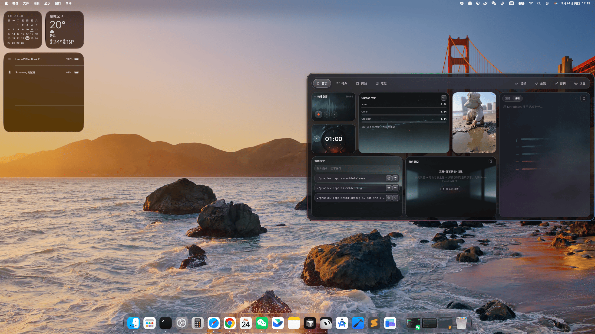
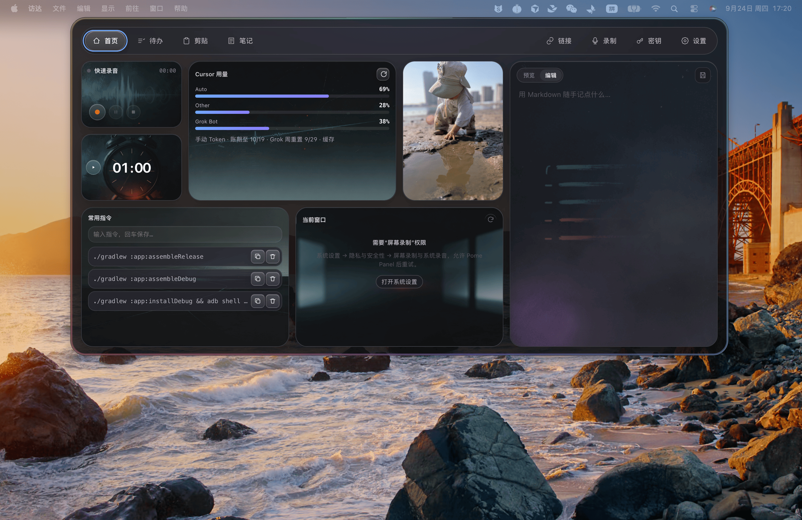

<div align="center">
  
  <h1>Pome Panel</h1>
  <p><strong>Mac 与 Windows 上的桌面工作台。</strong></p>
  <p>一块半透明玻璃面板。首页是 Bento，同一处切换待办、笔记、链接、录制与密钥。macOS 上收起后可以拖到屏幕四边，展开时从你停下的位置长出来。</p>
  <p>基于 Todo Panel 二次开发。</p>
  <p>
    <a href="#和-todo-panel-的差别">和 Todo Panel 的差别</a>
    ·
    <a href="#从源码运行">从源码运行</a>
    ·
    <a href="https://github.com/Sunanang/Pome-Panel/issues">反馈问题</a>
  </p>
  <p>
    
    
    
    
  </p>
</div>



首页展开后是一块玻璃面板，可以停在桌面一侧。里面是快速录音、番茄钟、Cursor 用量、照片、常用指令、当前窗口和 Markdown 速记。



同一块面板的近景。系统菜单栏留在它上方。待办、剪贴、笔记都在顶栏里切换，窗口大小不变。

## 和 Todo Panel 的差别

Pome Panel 基于 Todo Panel 二次开发。仓库没有登记可核对的上游地址，下面只列这个仓库里的能力。

| | Pome Panel |
| --- | --- |
| **它是什么** | 桌面控制台：Bento 首页，加上待办、笔记、链接、录制、密钥。待办是其中一页 |
| **放在哪里** | **两端都可以改位置。** 收起成一颗短胶囊，拖动后吸附到屏幕的上、下、左、右。靠近某一端时，展开面板靠向那个角（例如右下角）；否则沿这条边居中。位置会记住。设置里可以「重置到顶部」 |
| **首页** | 快速录音、番茄钟、Cursor 用量、常用指令、Markdown 速记、镜子。Mac 上还有汽水音乐和当前窗口。组件可以隐藏，也可以改布局。首页布局只留在本机 |
| **多设备** | 飞牛 NAS 伴侣（`fnos/` 里的 Pome Panel）。配对后，在多台设备之间同步待办、笔记、链接、常用指令、剪贴板、录音、AI 配置和密钥。密钥以加密盒传输 |
| **名字** | Pome Panel（石榴）。开发者 Lando |

## 面板怎么摆

折叠态是一颗短胶囊：贴在上下边时大约 85×9，贴在左右边时竖过来。点一下展开；按住拖动则搬家。松手时按指针离四边的远近吸附，坐标写进本机设置。沿这条边，离屏幕一端大约 120 逻辑像素以内时，展开面板会靠向那个角。没有自定义位置时，胶囊在顶部居中：macOS 上是菜单栏正下方，Windows 上是工作区顶部，都不会压住任务栏或菜单栏。

展开后各页内容区都是 `1240 × 540`。切换页面只换内容，不改窗口大小。窄屏和矮屏会留出边距。

菜单栏托盘可以重新显示面板、设置唤出快捷键、开机启动。默认唤出是悬停后按空格，也可以改成别的组合键。

## 里面有什么

| 页面 | 做什么 |
| --- | --- |
| **首页** | 上面的 Bento。至少保留一个组件；隐藏后其余格子重新铺满 |
| **待办** | 四个可改名的工作流（内部键仍是 P0–P3，默认「课程 / 自媒体&写作 / Vibe coding / 日常」）。新建默认当天 23:30，按截止时间排序，到期前一小时提醒 |
| **笔记** | 首页速记保存后进入笔记库，可搜索、重命名、编辑和删除 |
| **链接** | 只保存公开的 http/https。抓取标题时拒绝本机、内网和不安全重定向 |
| **录制** | 音频写在本机 `recordings/`。可选百炼 Qwen3-ASR 实时转写，API Key 经系统安全存储或环境变量读取 |
| **密钥** | 账号、密码和 API Key 使用系统安全存储，页面不能直接读出明文 |
| **设置** | 转写与智能命名、Cursor 用量 Token、NAS 同步、功能显隐、首页组件、镜子封面、默认展开页、唤出快捷键、面板位置、数据目录、开机启动 |

剪贴板历史默认关闭，可从菜单栏或「设置 → 显示功能」打开。它只在本机轮询，不占用全局快捷键。Windows 上没打开原生能力时，点击条目是复制，再用 Ctrl+V 粘贴。

Windows 上「汽水音乐」永久隐藏；「当前窗口」与剪贴板自动粘贴需要在「设置 → Windows 原生能力 · 实验功能」里手动打开（见 [Windows 上的几件事](#windows-上的几件事)）。关闭状态下不会改写已经保存的显隐偏好，换回 macOS 时组件还在。

飞牛同步在「设置 → NAS 同步」里填写地址和一次性配对码。设备令牌放在系统安全存储，不写入 LocalStorage。本机工作区仍是数据落点；明文 HTTP 默认关闭，回环地址除外。

## 设计原则

- **停在边上，展开才占一块桌面**：macOS 收起只留一颗胶囊，展开从你选的边长出来。窗口边界变更不使用系统动画，视觉动效留在渲染层，并尊重「减少动态效果」。
- **设备按需启用**：镜子只有主动点击才开摄像头，离开首页或收起时立刻释放。麦克风只在开始录音后使用，结束录音或退出应用时释放。
- **数据留在这台电脑**：待办、笔记、链接、录音元数据和工作区设置写在本地。可以更换数据文件夹，把工作区拷到另一台电脑。系统加密过的密钥不保证跨电脑迁移。
- **同步是附加项**：飞牛伴侣同步待办、笔记、链接、常用指令、剪贴板、录音、AI 配置和密钥。它不替换本机存储。首页布局不同步。
- **权限边界清晰**：链接抓取拒绝本机、内网和不安全重定向。窗口聚焦只接受最近一次扫描缓存里的窗口 ID。剪贴板跳过密码管理器标记为敏感的内容。

## 本机 AI 完成提醒

Pome Panel 只在 `127.0.0.1:43821` 监听通知，来源限 `codex`、`claude` 与 `gpt`，其余一律 404。提醒是一块不抢焦点的小窗。子代理结束和云端会话不会弹出。Windows 上点击提醒即关闭。

```bash
curl -X POST http://127.0.0.1:43821/notify/codex \
  -H 'Content-Type: application/json' \
  -d '{"title":"任务已完成","project":"my-project","task_id":"demo"}'
```

仓库提供 [Codex 转发脚本](scripts/codex-notify.js) 和 [Claude Code 转发脚本](scripts/claude-notify.js)。Codex 走 `~/.codex/config.toml` 的 notify；Claude Code 走 `~/.claude/settings.json` 的 Stop 钩子。云端会话（`CLAUDE_CODE_REMOTE=true`）会直接放弃，因为那里的 `127.0.0.1` 不是这台电脑。

## Windows 上的几件事

### 通知钩子怎么配

两个钩子都由 `node` 拉起，先确认 `node --version` 在 PowerShell 里能跑通。安装目录默认是 `%LOCALAPPDATA%\Programs\Pome Panel`，路径里有空格，所以命令中的脚本路径必须带引号，JSON 和 TOML 里的反斜杠还要再转义一次。

`%USERPROFILE%\.codex\config.toml`：

```toml
notify = ["node", "C:\\Users\\你的用户名\\AppData\\Local\\Programs\\Pome Panel\\resources\\app\\scripts\\codex-notify.js"]
```

`%USERPROFILE%\.claude\settings.json`：

```json
{
  "hooks": {
    "Stop": [
      {
        "hooks": [
          {
            "type": "command",
            "command": "node \"C:\\Users\\你的用户名\\AppData\\Local\\Programs\\Pome Panel\\resources\\app\\scripts\\claude-notify.js\""
          }
        ]
      }
    ]
  }
}
```

从源码运行时把路径换成仓库里的 `scripts\codex-notify.js` 与 `scripts\claude-notify.js`。转发脚本只往 `127.0.0.1:43821` 发一条本机请求，面板没开时静默失败，不会拖住 CLI。

### 原生能力（实验功能，默认关闭）

「当前窗口」、剪贴板自动粘贴和「点击完成通知聚焦对应窗口」在 Windows 上依赖进程内的 Win32 调用。这三项默认关闭，在「设置 → Windows 原生能力 · 实验功能」里打开后立即生效，不需要重启。

打开后：首页出现「当前窗口」，列出当前虚拟桌面上的窗口（按前后顺序，排除工具窗口），点击即切换并还原最小化的窗口；点击剪贴条目会自动粘贴回刚才的窗口，只发送一次 Ctrl+V，不安装全局键盘钩子。目标窗口以管理员身份运行时，系统会静默拦掉模拟按键，所以面板会提前识别并提示手动粘贴；目标已关闭或中途被切走，则退化为「已复制」。

之所以默认关闭：安装包不签名，而「模拟按键」「枚举并切换其他进程的窗口」是安全软件的常见启发式特征。Windows Defender、火绒与 360 的首轮测试都无告警后，才会改成默认开启。排障时可以用环境变量 `POME_DISABLE_WIN_NATIVE=1` 启动，强制不加载原生模块。

### 第一次打开时的 SmartScreen

安装包没有代码签名，Windows 会弹出「Windows 已保护你的电脑」。点**更多信息 → 仍要运行**即可。安装包每次发新版都会重新触发这一步。安全软件报「未知发布者」或「新增开机启动项」时，同样是未签名导致的，可以在各自的信任列表里放行。

### 已知限制

- **不签名**：见上面的 SmartScreen 流程。
- **不跟随虚拟桌面**：切到别的虚拟桌面后面板不会跟过去，切回来即可。
- **没有汽水音乐**：控制汽水音乐依赖 macOS 的脚本接口，Windows 上这个组件永久隐藏。
- **原生能力默认关闭**：「当前窗口」、自动粘贴与通知点击聚焦要手动打开，见上面一节。
- **Windows arm64 未测试**：只发 x64 安装包。arm64 设备会在仿真下运行，随包的原生模块也是 x64 的，没有验证过。
- **胶囊只有 9px 高**：贴在工作区顶部，会盖住最大化浏览器标签栏最上面的一小条。任务栏放在屏幕顶部时胶囊落在任务栏下方；Win11 把窗口拖到屏幕顶部中央弹出的 Snap 布局条也会和它重叠。
- **剪贴板只复制**：没开原生能力时，点击条目是写回系统剪贴板，需要自己按 Ctrl+V 粘贴。

## 从源码运行

桌面端要求 Node.js 18 及以上：

```bash
git clone https://github.com/Sunanang/Pome-Panel.git
cd Pome-Panel
npm install
npm test
npm start
```

没有渲染层构建步骤。`npm start` 就是完整的桌面运行路径。

| 命令 | 用途 |
| --- | --- |
| `npm test` | 单元测试与 JavaScript 语法检查 |
| `npm start` | 启动 Electron 开发版 |
| `npm run pack` | 生成本地未打包目录 |
| `npm run build` | 在 macOS 上构建 Apple Silicon 产物 |
| `npm run build:win` | 在 Windows 上构建 x64 产物 |
| `npm run build:zip` | 构建 ZIP 产物 |

官网在 `website/`，要求 Node.js 22.13.0 及以上，技术栈是 React 19 与 Vinext：

```bash
cd website
npm install
npm run dev
```

检查官网时使用 `npm run lint` 与 `npm run build`。

## 项目结构

```text
.
├── main.js                  # Electron 主进程：窗口、定位、菜单栏、剪贴板、媒体与通知
├── main-services.js         # 可单测的纯领域服务
├── preload.js               # contextBridge 安全桥
├── renderer/                # 桌面界面与交互
├── packages/sync-protocol/  # 桌面端与飞牛伴侣共用的同步协议
├── fnos/                    # 飞牛 NAS 伴侣 Pome Panel
├── scripts/                 # Codex / Claude Code 通知转发
├── tests/                   # Node 单元测试
├── build/                   # 图标与打包资源
├── docs/                    # 设计说明与 ADR
└── website/                 # React 19 + Vinext 官网
```

## License

[MIT](LICENSE) © 2026 [Sunanang](https://github.com/Sunanang)
